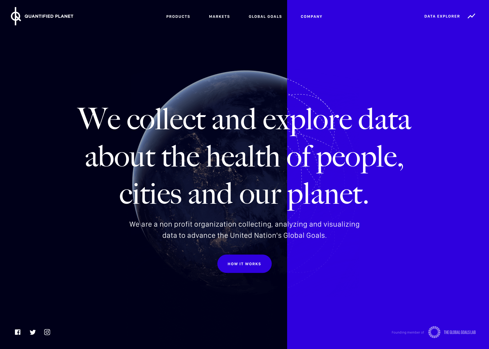

<div align="center">

# Quantified Planet

[](https://www.quantifiedplanet.org) [](https://github.com/codeandconspire/quantifiedplanet.org/releases) [](https://standardjs.com)



</div>

## Setup

The application requires [Node.js](https://nodejs.org) version 7 or later. Start with installing all dependencies by running the following command:

```bash
$ npm install
```

### Start the server

During development use the `start` script which loads the variables in the `.env` file, before starting the server. The server watches for file changes and restarts when needed.

```bash
$ npm start
```

## Technologies

### Choo

Choo is a front-end framework for authoring websites and apps using standard JavaScript syntax and APIs. Templates are defined in JavaScript files as [template literals](https://developer.mozilla.org/en-US/docs/Web/JavaScript/Reference/Template_literals) and transformed to actual DOM nodes. The generated tree is then compared with and morphed into the real DOM tree updating where needed, much like React, just without the virtual DOM-part. Routing to and rendering views are all handled by Choo.

### SUIT CSS

The CSS is written and organized following the [SUIT CSS](https://suitcss.github.io/) principles. The source is then processed with a few [postcss](https://github.com/postcss/postcss) plugins.

## Build and deploy

When building the application, take care to update the version field in [package.json](package.json). The version number is used for breaking cache and ensuring that clients are receiving up to date assets. Npm has a `version` command that does just this, commits it and generates a git tag.

```bash
$ npm version 2.1.0
```

To build and minify the application and styles run the build command. The build script will try and load the local `.env` file so make sure to define (overwriting) the appropriate variables before executing the script.

```bash
$ NODE_ENV=production npm run build
```

## License

[Creative Commons Attribution 3.0 Unported (CC-BY)](https://tldrlegal.com/license/creative-commons-attribution-(cc))
